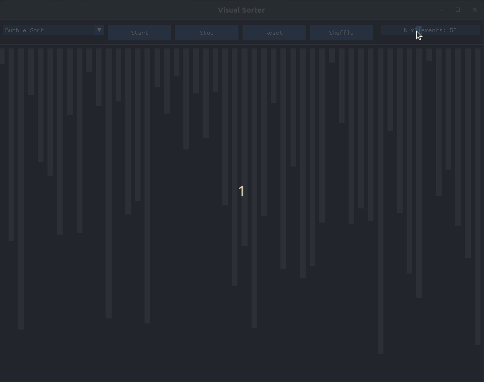

# sortingVisualiser

Welcome to my Sorting Visualiser.
This application allows you to visualize how different sorting algorithms work in real time. You can choose the number of elements to view, shuffle the elements, and select the sorting algorithm to visualize.


<p align="center">
  
</p>

## Features

- Visualize different sorting algorithms.
- Choose the number of elements to sort.
- Shuffle elements randomly.
- Select from multiple sorting algorithms.

## Dependencies

This project uses the following libraries:
- **ImGui**
- **OpenGL3**
- **GLFW**

## Installation

1. **Clone the Repository**:
   ```sh
   git clone https://github.com/nxtum/sortingVisualiser
   cd sortingVisualiser
   ```
2. **Build the Repository**:
   ```sh
   cd src
   make
   ```

3. **Run the Application**:
   ```sh
   ./sortingVisualiser
   ```

## TODO

-Add more algorithms
